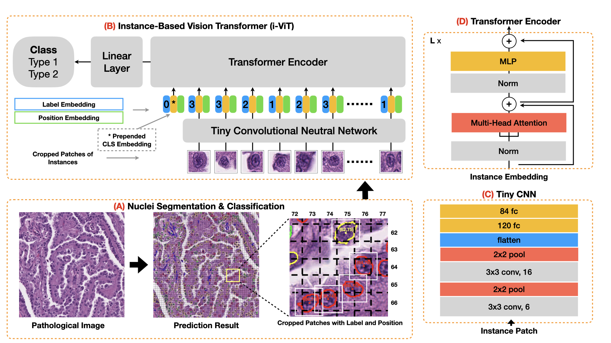

# Instance-based Vision Transformer for Subtyping of Papillary Renal Cell Carcinoma in Histopathological Image

The whole framework is composed by two parts.
- (A) Nuclei segmentation & classification
- (B) Instance-based Vision Transformer

The instance-based Vision Transformer (i-ViT) for learning robust representations of histopathological images for the pRCC subtyping task by extracting finer features from instance patches (by cropping around segmented nuclei and assigning predicted grades). 
The i-ViT takes top-K instances as input and aggregates them for capturing both the cellular and cell-layer level patterns by a position-embedding layer, a grade-embedding layer, and a multi-head multi-layer self-attention module. 

[Link]() to MICCAI 2021 paper.

## Set Up Environment

Our framework is composed by two parts, Please set up two environemnts based on:
- [Segmentation Enviroment](./nuclei_seg_cls_infer)
- [I-ViT Enviroment](./I-ViT)

## Dataset

Download the nuclei segmentation and classification dataset from [this link](https://dataset.chenli.group/home/ccrcc-grading).

Download the papillary RCC subtyping dataset from [this link](https://dataset.chenli.group/home/prcc-subtyping).

To use the [micronet](https://www.sciencedirect.com/science/article/pii/S1361841518300628) model trained on nuclei segmentation and classification
dataset and used in our paper, download it follow [Segmentation Model File](./nuclei_seg_cls_infer).

## Usage
- Download the papillary RCC subtyping dataset and unzip it to `./dataset`.
- Run the nuclei segmentation and classification inference to get the predicted mask of each tissue image. 
(Or download the predicted results from [the same link of pRCC dataset](https://dataset.chenli.group/home/prcc-subtyping))
- Train the I-ViT model follow the [Running Scripts](./I-ViT)

## License
This project is licensed under the MIT License - see the [LICENSE]() file for details
